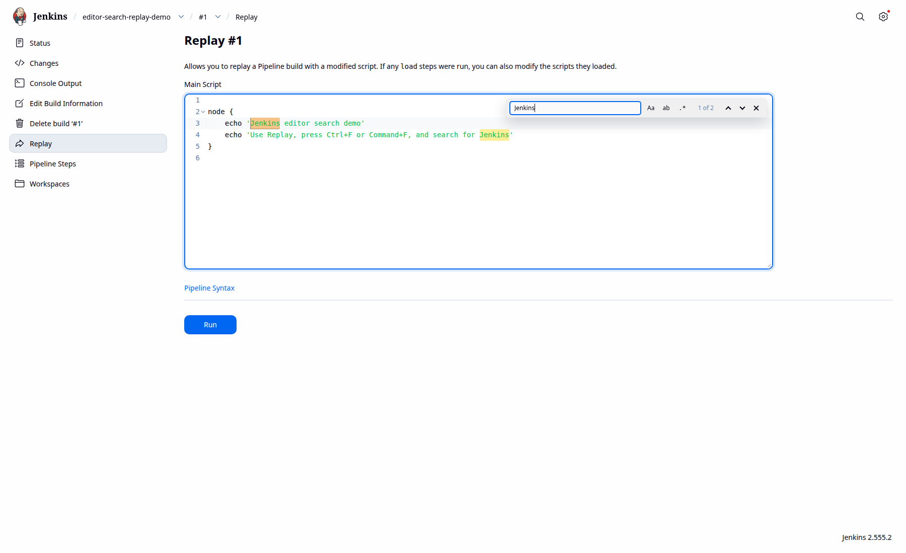
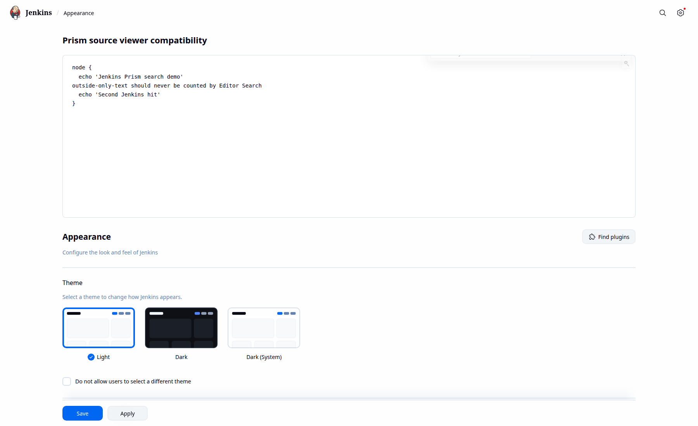
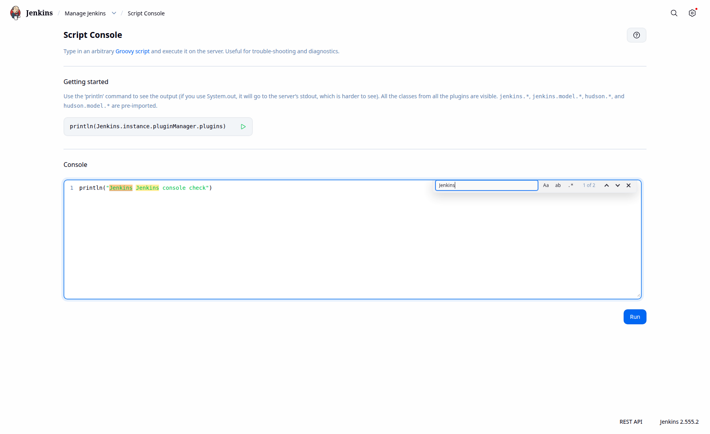

# Editor Search

Modern find-in-editor controls for Jenkins code editors.

Editor Search adds a compact search widget to Jenkins editor surfaces that otherwise have weak or missing search UI, including Pipeline Replay and the Script Console. It is designed to feel native in Jenkins, work from the keyboard, and stay out of the way of editor controls such as the Pipeline sample selector.



## Features

- Opens from `Ctrl+F` or `Command+F` when the cursor is in a supported editor.
- Adds an editor-local search button that hides while the search widget is open.
- Supports next and previous match navigation.
- Supports match case, whole word, and regular expression modes.
- Highlights all matches and the current match.
- Works with Jenkins light mode, dark themes, and Prism syntax highlighting themes.
- Avoids the Pipeline Replay sample selector when the script is empty.
- Supports dynamic loading for no-restart first installation.

## Supported Editors

Editor Search currently detects Jenkins CodeMirror and Ace editor instances, plus read-only Prism syntax highlighting code viewers. This covers the Jenkins Script Console, Pipeline Replay, source viewers powered by the Prism API plugin, and other Jenkins pages that use those editor widgets.



## Installation

After the plugin is available from the Jenkins update center, install it from **Manage Jenkins > Plugins**.

For local testing, install the generated `target/editor-search.hpi` with the Jenkins CLI:

```bash
java -jar jenkins-cli.jar -s http://localhost:8080/ install-plugin = -deploy < target/editor-search.hpi
```

The plugin declares `Support-Dynamic-Loading: true`, so a first installation can be deployed without restarting Jenkins. Manual file-copy installation into `JENKINS_HOME/plugins` still requires a Jenkins restart because Jenkins only scans that directory during startup.

## Usage

Focus a supported Jenkins code editor and press `Ctrl+F` or `Command+F`. The search widget opens inside the editor. Press `Enter` for the next match, `Shift+Enter` for the previous match, or `Escape` to close the widget.



## Compatibility

The plugin requires Jenkins `2.528.3` or newer and Java 17. It has been tested on Jenkins `2.541.2` and current LTS images.

## Reporting Issues

Report issues and enhancement requests in the [Jenkins issue tracker](https://issues.jenkins.io/) after the plugin is hosted by the Jenkins project.

## Contributing

Contributions are welcome. Follow the Jenkins project [contribution guidelines](https://github.com/jenkinsci/.github/blob/master/CONTRIBUTING.md).

## License

Licensed under MIT, see [LICENSE.md](LICENSE.md).
